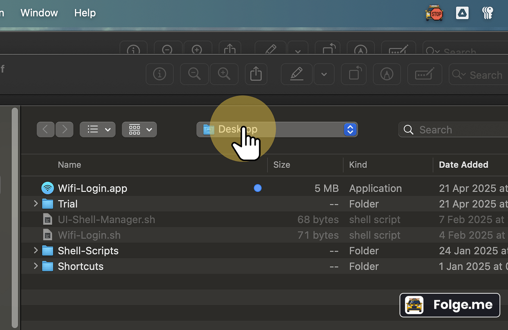

# 🔐 Auto WiFi Login for BITS Pilani

This Python script automates login to the BITS Pilani WiFi network. The network portal link (`http://192.168.1.1/`) is essentially the self IP address of the router, which automatically redirects users to the network's login page. The script handles this dynamic redirect process by extracting the required `4Tredir` parameter, sending login credentials via a POST request, and verifying internet connectivity.

---

## 🚀 Features

- 🔄 Automatically follows JavaScript redirect to extract `4Tredir`
- 📬 Submits login form using the `requests` library
- ♻️ Retries until internet connection is successful
- 🔐 Uses a separate `creds.py` file for storing credentials
- 📋 Copies info to clipboard via `pbcopy` (optional for MacOS and Linux)

---

## 🧰 Requirements

- Python 3.10+
- Internet browser redirect must pass through `http://192.168.1.1/` (It redirects to login page by default)

Install Python dependencies:

```bash
pip install -r requirements.txt
```

---

## 🛠️ Setup

Clone the repository:

```bash
git clone https://github.com/Aaravshah2907/College-Wifi-Login.git
```

Rename the `creds.py.example` file to `creds.py` and populate it with your credentials:

```python
# creds.py
USERNAME = "your_username"
PASSWORD = "your_password"
```

Run the script:

```bash
python wifi_login.py
```

---

## 🌀 Alternative Method: Shell Script

This project also provides a shell script for quick execution. After setting up your credentials in `wifi_login.sh` on line 45 and 46, you can use the `wifi_login.sh` script to automate the login process.

Make the script executable:

```bash
chmod +x wifi_login.sh
```

Run the script:

```bash
./wifi_login.sh
```

This method is especially useful for users who prefer a command-line approach without directly invoking Python.

---

## 🖥️ Alternative Method: macOS App

**Note:** Download the `MAC_Users-v1.0.zip` from the [GitHub Releases](https://github.com/Aaravshah2907/College-Wifi-Login/releases) section. Unzip the file and relocate the extracted application to a location of your convenience for easy access.

**1. Click "Finder"**

<p></p>

**2. Click "Applications"**

<p></p>

**3. Click "Automator.app"**

<p></p>

**4. Click on 'Open an existing Document'.**

<p></p>

**5. Locate the 'Wifi-Login.app'**

<p></p>

**6 Click "Wifi-Login.app"**

<p></p>

**7. Click Open**

<p></p>

**8. Make sure shell is set to './bin/bash' and input set to 'to stdin'**

<p></p>

**9. Click on USERNAME and enter your username inside the quotes.**

<p></p>

**10. Click on PASSWORD and enter your password inside the quotes.**

<p></p>

**11. Click "Run"**

<p></p>

**12. You should get this view at the bottom indicating no errors**

<p></p>

**13. Click "File"**

<p></p>

**14. Click "Save"**

<p></p>

> **⚠️ Note:** Since the application is downloaded from GitHub, macOS may block it from running initially. To allow the application to run, go to **System Preferences > Security & Privacy > General**, and click **Allow Anyway** for the blocked app. Then, try running the application again.

---

## ❓ Why the Need for This Project?

For macOS users, the default login process for the BITS Pilani WiFi network can be cumbersome. Each time the network is accessed, users are greeted with a login pop-up that requires manual input of credentials. This project eliminates the need for repetitive manual logins by automating the entire process, providing a seamless and efficient way to connect to the network.

---

## 📜 License

This project is licensed under the MIT License. See the [LICENSE](LICENSE) file for details.

---

## 🤝 Contributing

Contributions are welcome! Feel free to fork the repository, make changes, and submit a pull request. For major changes, please open an issue first to discuss what you would like to change.

---

## 🧑‍💻 Author

Developed by [Aarav Shah](https://github.com/Aaravshah2907). If you have any questions or feedback, feel free to reach out!

---
